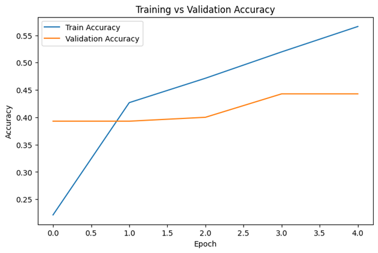
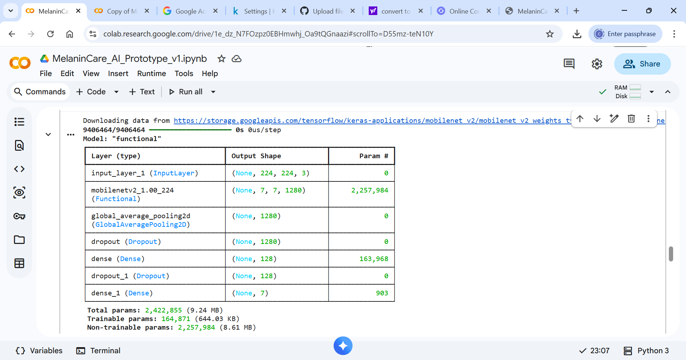

# MelaninCare AI – Skin Analysis Prototype

Developed by Chidinma Charity Igwe

## Project Overview

MelaninCare AI is a prototype machine learning model designed to explore fairness and bias in dermatological AI systems, with a focus on improving skin condition analysis for melanin-rich populations.

This project demonstrates how AI models behave when trained on limited or imbalanced datasets and highlights the importance of inclusive data in healthcare AI.

## Objectives

- To explore bias in AI-based skin classification systems  
- To develop a prototype model for skin condition detection  
- To evaluate model performance using training and validation metrics  
- To highlight the importance of inclusive datasets in AI  

## Model Development

The model was developed using Python and deep learning techniques.

Key steps included:
- Data preprocessing  
- Model training using transfer learning (MobileNetV2)  
- Model evaluation using validation data  

## Results and Evaluation

### Training Accuracy

### Validation Results

### Model Architecture

## Key Insight

The model demonstrates learning capability; however, performance is influenced by dataset limitations. This highlights the challenge of bias and underrepresentation in dermatology datasets, particularly for melanin-rich skin tones.

## Tools and Technologies

- Python  
- TensorFlow / Keras  
- Google Colab  
- GitHub  

## Significance

This project contributes to:

- AI fairness in healthcare  
- Understanding dataset bias  
- Building inclusive machine learning systems  

## Future Improvements

- Improve dataset diversity  
- Increase model accuracy  
- Deploy as a web or mobile application  
- Integrate real-world dermatological data  

##  Author

Chidinma Charity Igwe  
Data Analyst | AI Enthusiast | Healthcare Innovation Advocate  

## Disclaimer

This project is for educational and research purposes only and is not intended for medical diagnosis.
